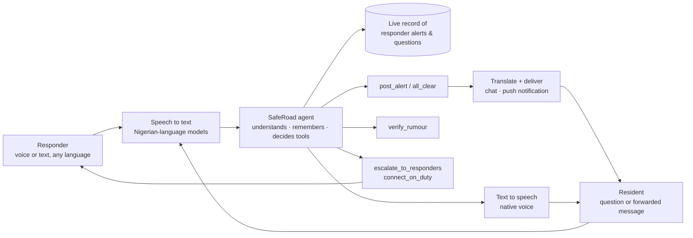

# SafeRoad

**A multimodal AI agent that turns a community's responders into a verified, real‑time safety line, in every resident's own language.**

🔗 **Live app:** https://saferoad-production.up.railway.app
🎥 **Demo video (2 min):** https://drive.google.com/file/d/1vYxsHgtYhEMc4BEF9dK8AQJuj5LJ3OI_/view?usp=sharing

> It's 6:40 PM in a town on the edge of a region that's seen trouble. Amara is closing her shop. A cousin heard something on WhatsApp, a neighbour saw movement on the road, the local vigilante group has a radio but no way to reach everyone quickly. By the time real information reaches Amara it's either too late, or it's a rumour that sends the whole market into panic for nothing. She needs to know, right now, whether the road home is safe, and she needs to trust what she's told.

---

## The problem

In many Nigerian towns the people who know first are the local vigilante or community security group. They carry two‑way radios, so they can talk to **each other** instantly, but that channel is closed: residents are not on it. So the truth stays inside the radio circle while rumours run through WhatsApp forwards and word of mouth. Amara's problem is everyone's problem:

- **Too much noise.** Forwarded messages, half‑heard stories, panic.
- **Too little verified signal.** Nobody can tell what a responder actually confirmed, from what someone's cousin said.
- **No time.** She needs an answer in the next minute, in a language she speaks, without reading a report.

## How SafeRoad solves it

SafeRoad is the bridge from the radio circle to the town. It is a single AI agent with two doors:

| | Responders (vigilante / community security) | Residents (Amara) |
|---|---|---|
| **What they do** | Speak what they see, in any language, by voice or text | Ask about any road or area, or forward a message they received |
| **What the agent does** | Turns it into a structured alert and publishes it to every resident, translated, in seconds | Answers **only** from what responders have confirmed, names the source and the time, and never guesses |
| **When nobody knows** | Receives residents' unanswered questions in their chat | Is told honestly that nothing is confirmed, the responders have been asked, and gets a **tap‑to‑call** button for the responder on duty |

Every answer is one of four honest states, always with **who** and **when**:

- ✅ **Confirmed** — "Musa confirmed a fight near the market 12 minutes ago. Avoid Kaduna road."
- 🔵 **Contradicted** — "Musa reported the market clear 8 minutes ago. The message you received is not confirmed."
- 🟠 **Unconfirmed** — "3 residents reported this, no responder has confirmed. I've asked them and will message you."
- ⚪ **No information** — "No responder has reported anything about Kaduna road today. I've asked them. You can call Musa, who is on duty."

## Key features

- **🎤 Voice in, voice out.** Hold the mic and speak. The agent transcribes, understands, and replies in text *and* in a native Nigerian voice. No typing needed.
- **🌍 Your own language.** Yorùbá, Hausa, Igbo, Nigerian Pidgin and English. Language is detected per message, so a Hausa voice note from a responder becomes a Yorùbá alert for one resident and an English one for another.
- **🤖 An agent that acts, not a chatbot.** Every message goes through a reasoning model that plans and runs tools: `post_alert`, `verify_rumour`, `escalate_to_responders`, `connect_on_duty`, `translate`, `all_clear`, `file_resident_report`.
- **⚡ Real time.** Alerts land in every resident's chat the moment a responder posts, over a live connection, plus **push notifications** that work even with the app closed.
- **📱 Installs from the browser.** A progressive web app: one tap on Android, "Add to Home Screen" on iPhone. No app store, no download.
- **🧠 Context.** "Any update?" and "Is it over?" are understood as follow‑ups to what you asked before. The agent remembers your conversation and your open questions.
- **📞 Tap to call.** Responders can go **on duty**; when the agent has no confirmed answer it offers a direct call button so nobody waits.
- **🔒 Verified roles.** Residents verify their email with a one‑time code. Responders join with an invite code from their group leader, so only real security members can broadcast.
- **♻️ The loop closes itself.** When a responder answers a resident's question, the resident is told automatically, with the responder's name and the time. "All clear" closes the alert for everyone.

## How it works



1. **Understand.** Voice notes are transcribed with Nigerian‑language speech models (long notes are chunked; two transcription candidates are produced so accented English is never mangled). The agent reads the conversation history and the person's open questions.
2. **Verify.** It compares the message with every responder alert from the last 24 hours and grades it: confirmed, contradicted, unconfirmed, or no information.
3. **Act.** It runs the right tools: publish an alert, translate it for each resident, escalate to responders, file a report, offer the on‑duty responder's number.
4. **Speak.** It replies in the person's language, in text and voice, and notifies everyone who needs to know.

## Try it

**Live:** https://saferoad-production.up.railway.app

The login page has two **demo buttons** that fill the details and log you in:

- **Resident demo** — ask the agent, receive alerts.
- **Responder demo** — post alerts by voice, answer residents.

Or create your own account. Responder signup uses the invite code shown on the page (prefilled for the hackathon; in production it is shared privately by the group leader). Open it on two devices to see the real‑time loop: post an update as the responder and watch it land on the resident's side, translated, within seconds.

## Tech stack

- **Backend:** Python, FastAPI, Server‑Sent Events for live updates, Web Push (VAPID) for notifications.
- **Data:** MongoDB Atlas (users, conversations, alerts, questions, media).
- **Speech:** [Spitch](https://spitch.app) for Nigerian‑language speech‑to‑text and text‑to‑speech.
- **Reasoning:** DeepSeek (JSON tool planning), with Google Gemini as fallback.
- **Email:** Resend, for one‑time verification and password‑reset codes.
- **Front end:** server‑rendered HTML with Tailwind, a small vanilla‑JS client (raw microphone capture to WAV, no browser speech APIs), service worker, installable PWA.
- **Hosting:** Railway.

## Run locally

```bash
git clone https://github.com/Abdullah-webd/saferoad.git && cd saferoad
python3.12 -m venv .venv && source .venv/bin/activate
pip install -r requirements.txt
cp .env.example .env        # fill in MongoDB, Spitch, DeepSeek, Resend, VAPID keys
uvicorn app.main:app --reload --port 8000
```

Generate VAPID keys once with `vapid --gen` (from `py-vapid`). Push notifications and install require HTTPS, so use `ngrok http 8000` to test on a phone.

## Repository layout

```
app/
  main.py            routes: auth (OTP, reset), chat, alerts, profile, admin, APIs, SSE
  agent.py           the agent's system prompt, tool decisions, translation
  llm.py             DeepSeek client (JSON mode) with Gemini fallback
  speech.py          Spitch transcription (chunked, dual candidates) and speech
  notify.py          live-event broker + Web Push delivery
  pipelines/
    chat.py          one conversation per person: store → transcribe → decide → reply → tools → voice
    tools.py         post_alert, all_clear, escalate, file report, dismiss report
  web/templates      landing, auth, chat, alerts, profile, admin
  web/static         app.js, app.css, service worker, manifest, icons
demo/                scripts that recorded and composed the demo video
architecture.md      design notes
```

## Built for

The **KTechFest AI Hackathon**, screening challenge "Build Something That Helps". Every part of the demo video was recorded live against the production app with real accounts and the real agent.
