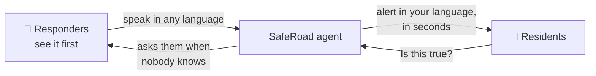
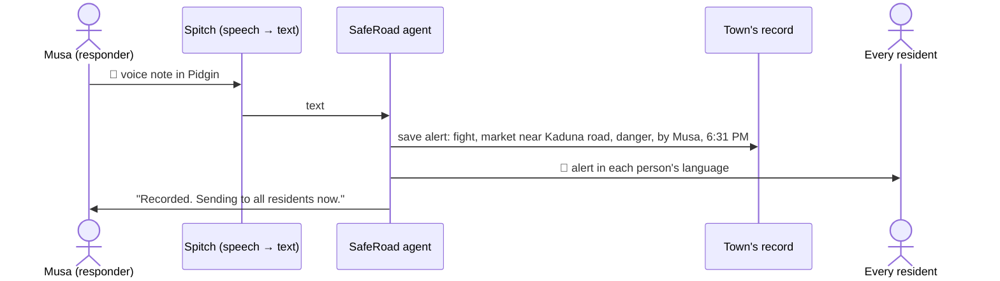
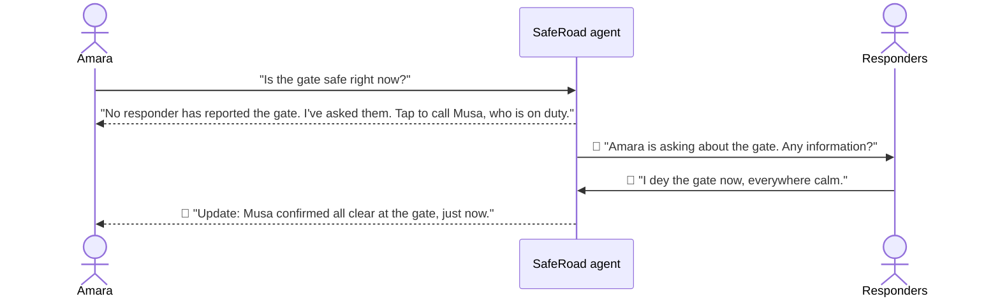
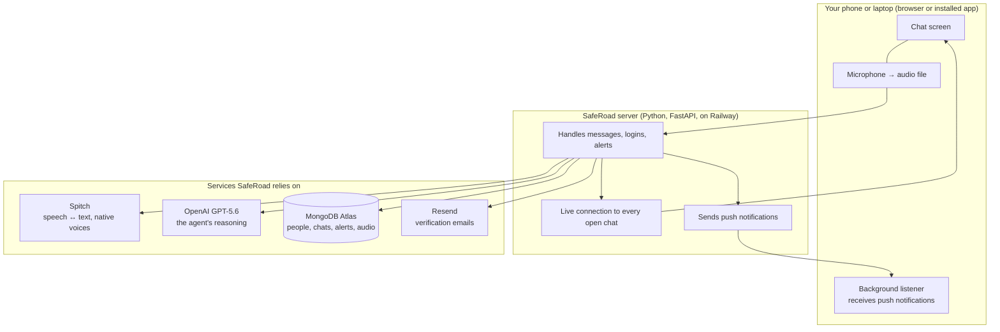

# How SafeRoad works

This page explains SafeRoad the way you would explain it to a friend who has never built software. If you want the code, the [README](README.md) shows where everything lives.

**Live app:** https://saferoad-production.up.railway.app

---

## 1. The idea in one picture

Think of a town with two kinds of people.

- **Responders** are the local vigilante group. They walk the roads, so they always know first when something is wrong. They have radios, but radios only reach each other.
- **Residents** are everyone else, like Amara closing her shop. They hear rumours on WhatsApp and have no way to know what is true.

SafeRoad puts one **AI agent** between them. Responders talk to it; it tells the whole town. Residents ask it; it answers only from what responders actually said.

---

## 2. What happens when a responder speaks

1. Musa, a responder, holds the mic and says in Pidgin: *"Fight dey happen for market near Kaduna road, make everybody avoid am."*
2. **Spitch**, a Nigerian speech company, turns his voice into text. It understands Yorùbá, Hausa, Igbo, Pidgin and English properly, not as accented English.
3. The **agent** (OpenAI's GPT‑5.6) reads the text and works out: what happened (a fight), where (market near Kaduna road), how serious (danger), and what people should do (avoid it). It writes this up as an alert.
4. The alert is **translated once for every language** residents use, and sent to each resident in theirs.
5. Every resident's phone gets a **push notification**, even if the app is closed, and the alert appears in their chat with Musa's name and the time.
6. Musa gets a short read‑back in his own language confirming what was recorded.

All of this takes seconds.

---

## 3. What happens when a resident asks

Amara gets a forwarded message: *"The whole town is under attack, everybody run!"* She sends it to SafeRoad.

The agent does three things:

1. **Looks at the town's record**: every alert responders have posted in the last 24 hours, with the place and the time of each.
2. **Thinks about place and time.** A fight at the market an hour ago is not "the whole town under attack". An all‑clear from six hours ago says nothing about something new happening right now. A report about the market says nothing about the gate.
3. **Answers honestly**, in one of four ways, always naming who said it and how long ago:

| Answer | Example |
|---|---|
| **Confirmed** | "Musa confirmed a fight near the market 12 minutes ago. Avoid Kaduna road." |
| **Contradicted** | "Musa reported the market clear 8 minutes ago. The message you received is not confirmed." |
| **Unconfirmed** | "Three residents reported this, no responder has confirmed. I've asked them and will message you." |
| **No information** | "No responder has reported anything about the gate. I've asked them. You can call Musa, who is on duty." |

The agent is not allowed to say "safe" or "true" on its own. When it does not know, it says so, and it goes to find out.

---

## 4. When nobody knows: the loop closes itself

- Amara's question lands in every responder's chat and on their phones.
- The first responder who answers closes the loop: Amara is told automatically, with his name and the time.
- If Amara cannot wait, she has a **Call** button for the responder who is on duty. Responders switch "On duty" on and off themselves, so their number is only shared when they want it to be.
- When a responder says "all clear", the alert closes for everyone.

---

## 5. Why voice and language matter

Most people in these towns do not want to type, and many do not read English comfortably. So:

- You **speak** to SafeRoad, and it **speaks back** in a native voice for your language, generated by Spitch.
- The language is detected **per message**, so you can switch any time. A Hausa voice note from a responder becomes a Yorùbá alert for one resident and an English one for another.
- Long voice notes are split into pieces and transcribed twice (once assuming your profile language, once assuming English), and the agent picks the version that makes sense. That stops accented English from being garbled.

---

## 6. The agent's tools

The agent does not just talk. It decides which of these to run, and the app runs them:

| Tool | What it does |
|---|---|
| `post_alert` | Turns a responder's words into an alert and sends it to every resident in their language. "All clear" closes earlier alerts. |
| `escalate_to_responders` | Sends a resident's question or request to all responders and promises to report back. |
| `file_resident_report` | Records something a resident saw as *unconfirmed* and asks responders to check. |
| `dismiss_report` | A responder checked a resident report and found nothing; the reporter is told. |
| `connect_on_duty` | Shows the Call button for the responder currently on duty. |
| `translate` | Turns any alert or message into the reader's language. |

There are no rigid if‑then rules telling the agent what to do. It is given the situation, the town's record with places and times, and these principles: only responders' reports are verified; time matters as much as place; never claim to know more than the data; when in doubt, get a responder to look. Then it reasons.

---

## 7. What the app looks like

- **Chat.** One conversation per person with the agent, like WhatsApp. Alerts, answers and updates all arrive inside it, and the whole history stays.
- **Alerts.** A list of everything responders have posted.
- **Profile.** Language, photo, and for responders: phone number, area, and the On duty switch.
- It **installs like an app** from the browser (Android: tap Install; iPhone: Share → Add to Home Screen) and works on phones and laptops.
- Sign‑up verifies your email with a 6‑digit code. Responders also need an **invite code** from their group leader, so only real security members can broadcast.

---

## 8. The pieces, and what each one is for

| Piece | Plain-English job |
|---|---|
| **The app in your browser** | Shows the chat, records your voice as a plain audio file (no browser speech tricks), plays replies, and can be installed to your home screen. |
| **The server** | The brain's assistant. It receives every message, calls the services below, saves everything, and pushes updates to everyone who needs them, instantly. |
| **Spitch** | Hears Nigerian languages properly and speaks them back in a natural voice. |
| **OpenAI GPT‑5.6** | The agent's reasoning: understands the message, weighs what is verified, decides what to say and which tools to run. GPT‑5.5 steps in if 5.6 is busy; Google Gemini is the last resort. |
| **MongoDB Atlas** | The town's memory: people, conversations, alerts, questions, voice files. |
| **Resend** | Sends the one‑time codes for sign‑up and password reset. |
| **Push notifications** | Standard web push, so alerts reach a phone even when the app is closed. |
| **Railway** | Where the server runs on the internet. |

---

## 9. Trust and safety, in short

- Only responders can broadcast, and they join by invite code.
- Every alert and every answer carries a name and a time.
- The agent never invents information. Silence means "not confirmed", never "safe".
- Residents' own reports are marked unconfirmed until a responder checks.
- A responder's phone number is shared only while they choose to be on duty.

---

## 10. What would change for a real town

- Verify responders through the local government or traditional ruler's office, not only an invite code.
- Add wards or areas so people only receive alerts for where they live.
- Add SMS for feature phones and a WhatsApp channel, using the same agent underneath.
- Keep the last responder's report visible per road, so "is X road safe?" can also show a simple map.
