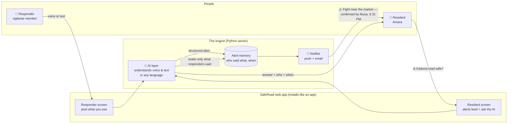
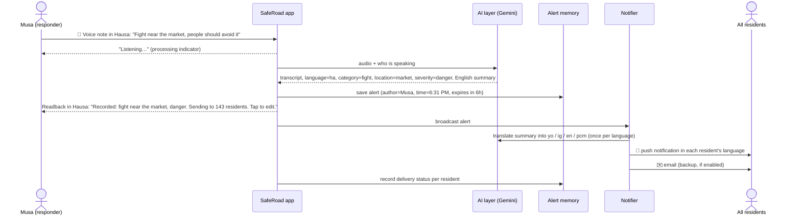
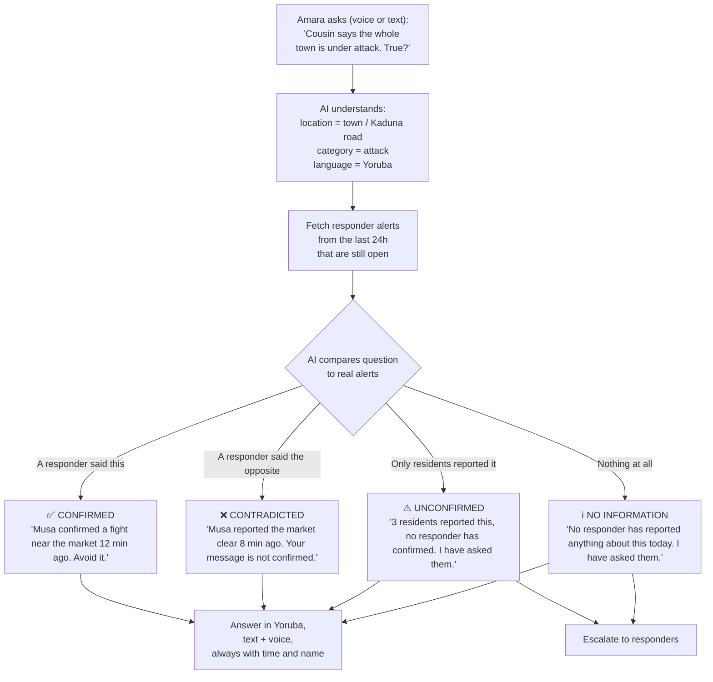
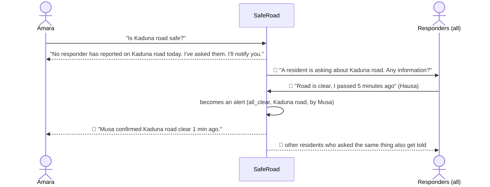
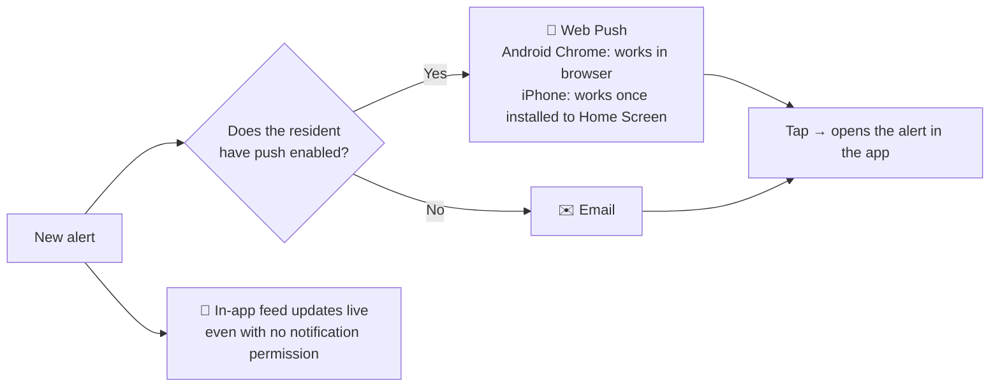
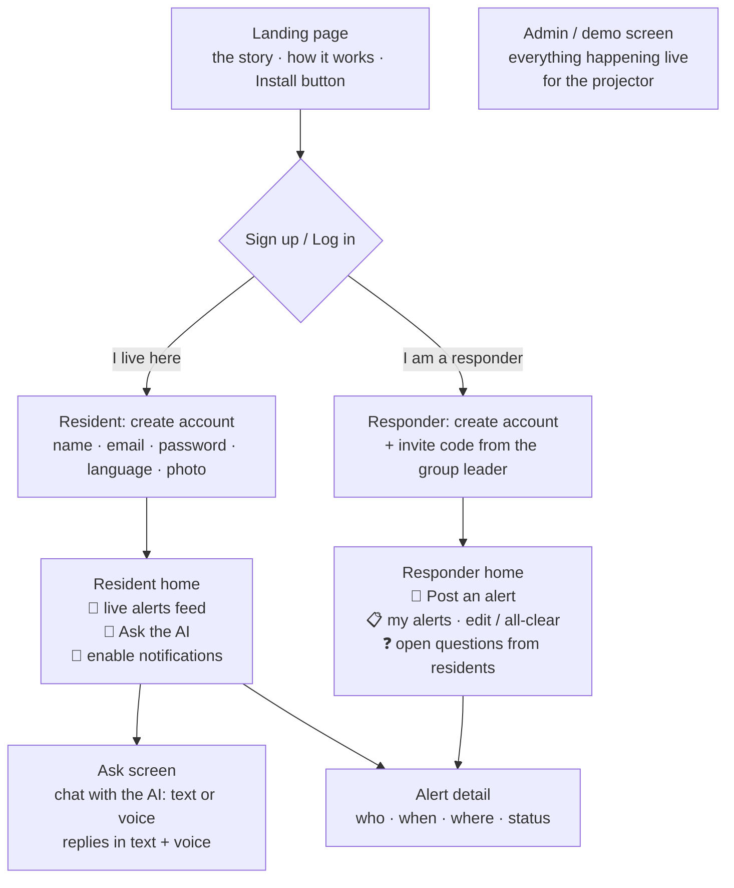
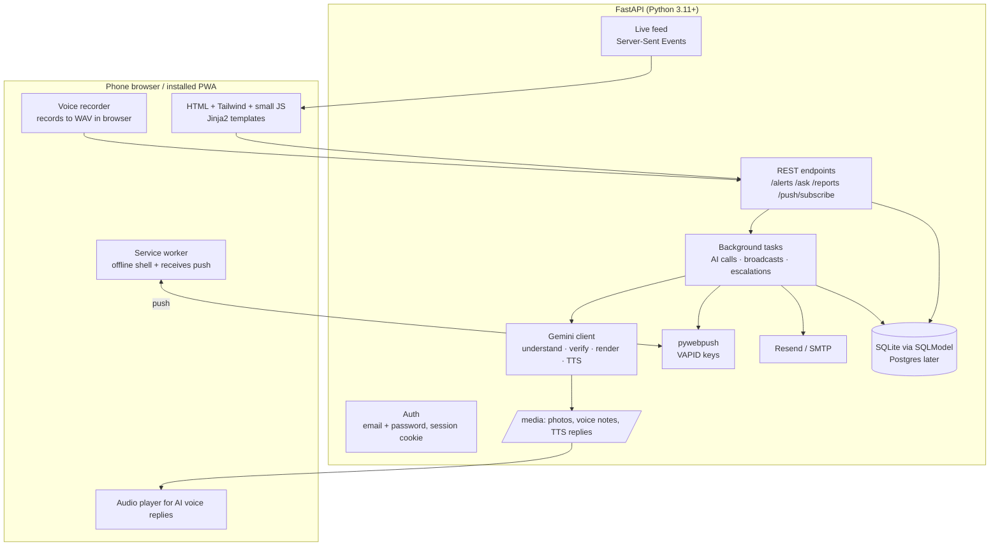
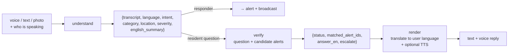
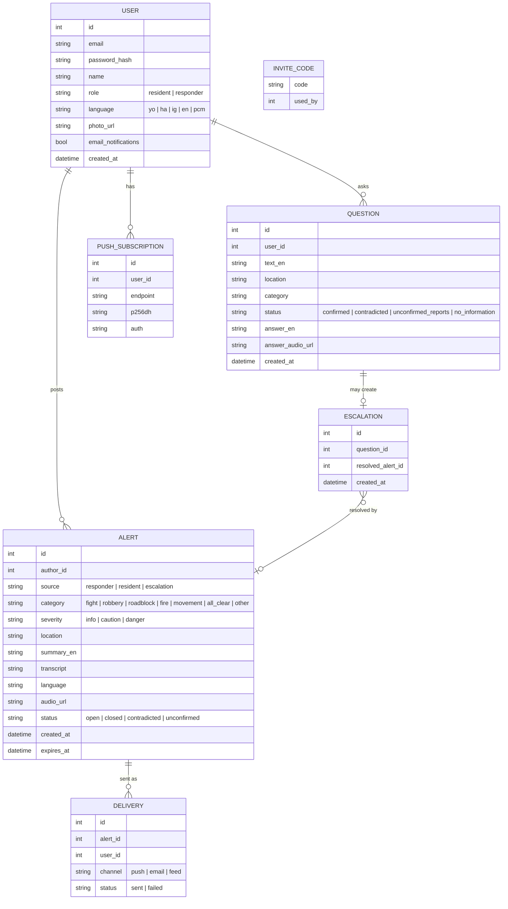

# SafeRoad — Architecture (Web App / PWA version)

> Verified community safety alerts, in your language, on your phone, in seconds.

SafeRoad is a website that installs like an app. Two kinds of people use it:

- **Responders** — the local vigilante / community security group. They know what is happening first. They post what they see, by voice or text, in Yoruba, Hausa, Igbo, English or Pidgin.
- **Residents** — people like Amara. They get an instant notification when a responder posts, and they can ask the AI "is this true?" about anything they heard, and get an answer that says exactly who confirmed it and when.

Everything below is written so that a non‑technical reader can follow the diagrams. The technical detail is underneath each one.

---

## 0. Why we moved from WhatsApp to a web app (and what we say to judges)

We have 72 hours. The WhatsApp route adds a sandbox with a 24‑hour messaging window, a 72‑hour auto‑disconnect, media‑fetching quirks and a Meta approval process for anything real. Every hour spent debugging that is an hour not spent on the actual idea: **turning noise into verified signal**.

A Progressive Web App (PWA) gives us the same experience with none of that:

| Need from the brief | How the PWA meets it |
|---|---|
| Reach Amara instantly | Push notifications to her phone (Android and installed‑iOS), plus email as a backup |
| No new app to download | The site installs from the browser; on Android it shows an **Install** button, on iPhone "Add to Home Screen" |
| Voice, because typing is slow and literacy varies | Hold‑to‑record voice button; AI understands the audio directly |
| Her language | AI detects it and answers in it, in text and voice |
| Trust | Every alert shows the responder's name and time; the AI only quotes responders, never guesses |

The alert engine is channel‑independent. WhatsApp and SMS are adapters we can bolt on for the final. That is the line for the pitch: *"Today it is a PWA. The same engine can speak WhatsApp tomorrow."*

---

## 1. The big picture



**In plain words:** A responder sees something and tells SafeRoad, speaking or typing in whatever language they like. The AI turns that into a clean alert (what, where, how serious, who said it, when) and stores it. Every resident's phone buzzes with the alert in *their* language. When Amara hears a rumour, she asks SafeRoad. The AI looks only at what responders have actually said and tells her: confirmed, contradicted, or nobody has reported it yet, with a time. It never makes things up.

---

## 2. A responder posts an alert



**In plain words:** Musa presses the record button and speaks. Within seconds the app reads back what it understood so he can fix a mistake. Then every resident gets a notification in their own language. The app keeps a record of who was reached.

---

## 3. A resident asks "is this true?"



**In plain words:** Amara asks a question. The AI checks it against what responders have actually said today. There are only four possible answers, and each one tells her who said it and how long ago. If nobody has confirmed anything, the app does not guess; it says so, and it goes and asks the responders on her behalf.

---

## 4. The escalation loop (when nobody knows yet)



**In plain words:** Unanswered questions do not die. The app forwards them to the responders, and the first responder who answers closes the loop for everyone who asked. Responders never have to give out their phone numbers.

---

## 5. How notifications reach people



**In plain words:** The best channel is a push notification, the same kind Instagram sends. Residents allow it once. If they refuse or are on an iPhone without installing, they still get an email and the feed inside the app updates live.

Technical notes:
- Web Push uses the browser Push API + a service worker + VAPID keys (generated once, free, no third party). Library: `pywebpush`.
- iOS Safari supports Web Push from iOS 16.4 **only for PWAs added to the Home Screen**. That is why the install prompt is front and centre.
- Email via Resend (free tier, one API key) or SMTP. Email is a backup, not the main channel; it is too slow for "right now".
- The in‑app feed uses Server‑Sent Events (SSE) for live updates, with polling fallback.

---

## 6. Screens



Every screen is mobile‑first. The landing page has the install button (Android/Chrome) or "Add to Home Screen" hint (iOS). "Typing…" / "Listening…" indicators show whenever the AI is working.

---

## 7. Technical components



**Stack (all Python, no Next.js):**
- **FastAPI + Jinja2 + Tailwind (CDN)** for pages. Tiny vanilla JS for recorder, install prompt, push subscription, SSE.
- **SQLModel + SQLite** (single file DB, zero setup). Swap the URL for Postgres on deploy if needed.
- **Gemini 2.5 Flash** for understanding audio/text/images and for verification. **Gemini 2.5 Flash TTS** for voice replies (returns PCM; we wrap it as WAV in pure Python with the `wave` module, so **no ffmpeg needed**).
- **Voice input**: the browser records raw PCM via Web Audio and builds a WAV blob in JS (~40 lines). WAV is accepted by Gemini on every browser, avoiding the Chrome‑webm vs Safari‑mp4 mess.
- **Web Push**: `pywebpush` + VAPID. **Email**: Resend.
- **Auth**: email + password (passlib/bcrypt), signed session cookie. Responders need an invite code at signup.
- **Deploy**: Render or Railway free tier (HTTPS is required for PWA install and push). ngrok for local phone testing.

---

## 8. AI layer (three narrow jobs, strict JSON)



- **understand** — one Gemini call with the audio (or text/photo) inline. Returns the JSON above. `intent` ∈ report / question / chat / all_clear.
- **verify** — gets the resident's structured question plus only the open alerts from the last 24 h. The prompt forbids inventing facts: it may cite only the alerts it was given and must return one of the four statuses. `escalate=true` for unconfirmed / no_information.
- **render** — translates the English answer into the user's language; if the user spoke, also produces a voice reply. Every answer includes responder name and "X minutes ago".

Guardrails: the AI never says "safe" or "true" without a matched alert; alerts expire (default 6 h); `all_clear` closes matching open alerts; a responder can edit or delete their own alert within the app.

---

## 9. Data model



---

## 10. Repo layout

```
ktechfest-ai/
  app/
    main.py                 # FastAPI app, routes, static, templates
    config.py               # settings from .env
    db.py                   # SQLModel models + session
    auth.py                 # signup / login / session
    gemini.py               # understand / verify / render / tts (WAV)
    notify.py               # web push + email + SSE broker
    pipelines/
      alerts.py             # report → alert → broadcast
      questions.py          # question → verify → answer / escalate
      reports.py            # resident reports + clustering (stretch)
    web/
      templates/            # landing, auth, resident, responder, admin
      static/
        app.js              # recorder (WAV), install prompt, push subscribe, SSE
        sw.js               # service worker: shell cache + push handler
        manifest.webmanifest
        icons/
  media/                    # uploads + generated audio (gitignored)
  tests/
  architecture.md
  README.md
  .env.example
  requirements.txt
```

---

## 11. Keys and setup

| Item | Where | Env var |
|---|---|---|
| Gemini API key | aistudio.google.com → Get API key | `GEMINI_API_KEY` |
| VAPID public/private keys | generated once locally: `vapid --gen` (from `py-vapid`) | `VAPID_PUBLIC_KEY`, `VAPID_PRIVATE_KEY`, `VAPID_CLAIMS_EMAIL` |
| Resend API key (email) | resend.com → API keys (free tier) | `RESEND_API_KEY`, `EMAIL_FROM` |
| App secret (sessions) | random string | `APP_SECRET` |
| Responder invite code(s) | you choose | `RESPONDER_INVITE_CODES=KTF-2026,...` |
| Public URL | ngrok or Render URL | `PUBLIC_BASE_URL` |

Local tools: **Python 3.11+** (`brew install python@3.12`; system Python 3.9 is too old), **ngrok** (`brew install ngrok`) for testing on real phones. No ffmpeg, no Twilio.

---

## 12. Build order (72 hours)

| Day | Milestone | Done when |
|---|---|---|
| 1 AM | Skeleton: FastAPI, DB, auth, resident + responder shells, deploy to Render | You can sign up on your phone over HTTPS |
| 1 PM | Voice in → Gemini understand → reply in same language, text + voice out | Yoruba voice note gets a Yoruba answer |
| 1 PM | Responder posts alert → stored → live feed via SSE | Alert appears on a second phone without refresh |
| 2 AM | Web Push + email broadcast, install button + iOS hint | Phone buzzes while app is closed |
| 2 PM | Ask the AI: four‑state verify with names and times; escalation loop | Demo script §13 runs end to end |
| 3 AM | Landing page polish, admin/demo screen, photos in onboarding | Looks like a product |
| 3 PM | Rehearse with 3 phones, record a backup video, write submission | Nothing left to chance |

Stretch: resident reports + clustering; per‑area subscriptions; WhatsApp adapter stub for the pitch.

---

## 13. Demo script

1. Projector: admin screen, empty. Phone A = Amara (Yoruba), Phone B = Musa (responder, Hausa), Phone C = resident (English), app closed on A and C.
2. Amara opens the app, holds the mic: *"Ṣé ojú ọ̀nà Kaduna dára?"* (Is Kaduna road safe?). Typing indicator. Reply in Yoruba text + voice: *no responder has reported anything, I've asked them.*
3. Musa's phone buzzes with the question. He records in Hausa: fight near the market, avoid it.
4. Within seconds: admin screen shows the alert; Phone A buzzes (Yoruba); Phone C buzzes (English), both with the app closed.
5. Phone C types the rumour: *"They say the whole town is under attack?"* → *"Musa confirmed a fight near the market 2 min ago. Nothing about an attack on the town."*
6. Musa posts "all clear". Everyone gets the update. Amara goes home.

---

## 14. What changed versus the WhatsApp plan, and what to say about it

- **Lost:** "Amara already has WhatsApp". **Gained:** zero third‑party risk, an install button, push that works with the app closed, a proper UI for responders (edit, all‑clear, open questions), and full control over the demo.
- The engine (understand → alert → verify → notify) is untouched. WhatsApp/SMS become adapters in `notify.py` and an inbound webhook, which is exactly the upgrade to promise for the final.
- Typing indicator is now trivial: it is just UI state while the request is in flight.
